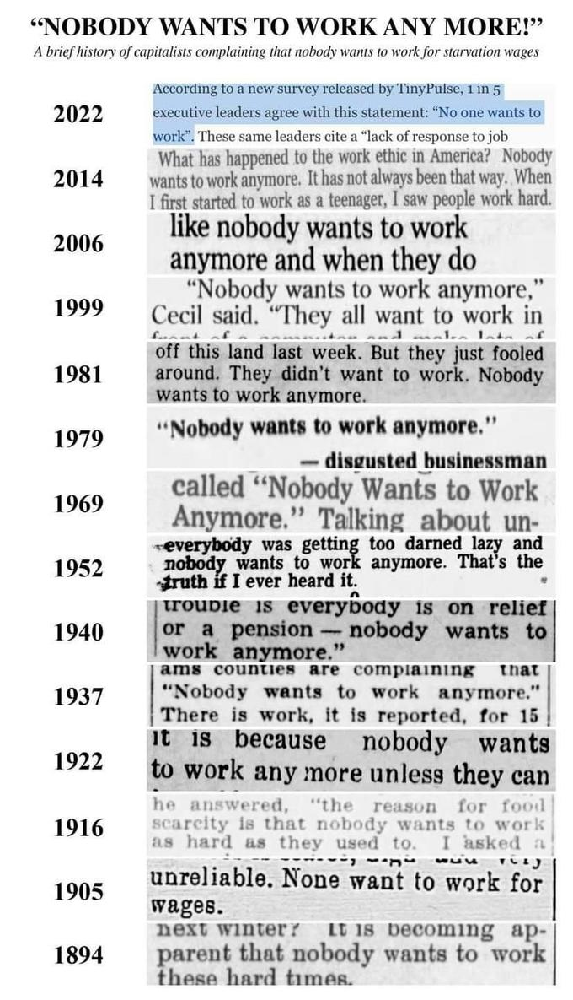

I'm so fucking tired of hearing older generations complain about how "nobody wants to work anymore."

The pervasive narrative that "nobody wants to work anymore" is a myth that has persisted for far too long. As a member of Generation Z, I can attest to the fact that this stereotype is unfounded and harmful. In this post, we'll debunk this myth and explore the complex factors contributing to labor shortages, as well as the changing expectations of the modern workforce.

### The Enduring Myth of the Lazy Millennial / Gen Z

The stereotype of the lazy millennial has been circulating for years, often used to justify negative perceptions and discriminatory practices. It's a harmful generalization that ignores the diverse experiences and aspirations of an entire generation. However, it's important to understand that this myth is not new. Throughout history, there have been similar narratives about younger generations being lazy or entitled.

### The Complex Reality of Labor Shortages

The idea that young people are simply unwilling to work is a simplistic explanation for the current labor shortages. The truth is much more complex, involving a confluence of factors:

* **The Great Resignation:** The COVID-19 pandemic prompted many people to reassess their priorities and seek more fulfilling careers. This led to a wave of resignations, leaving businesses scrambling to fill vacancies.
* **Rising Costs of Living:** The increasing cost of living makes it difficult for individuals to make ends meet, forcing them to work multiple jobs or longer hours.
* **Job Insecurity:** The threat of economic downturns and layoffs can make people hesitant to leave their current jobs, even if they are not fulfilling.
* **Poor Working Conditions:** Long hours, low pay, and toxic work environments can deter potential employees and lead to high turnover rates.
* **Mental Health Concerns:** The pandemic has exacerbated mental health issues, making it challenging for individuals to focus on work and maintain productivity.

### The Changing Expectations of the Modern Workforce

Millennials and Gen Z have distinct expectations compared to previous generations. We prioritize meaningful work that aligns with our values, work-life balance that allows us to pursue personal interests, opportunities for growth and development, and flexible work arrangements. We are less likely to tolerate long hours, demanding schedules, or excessive workloads. We seek jobs that offer training, education, and career advancement opportunities. We are also more likely to seek out mentors and coaches to help us develop our skills and advance our careers.

### The Role of Employers in Attracting and Retaining Talent

To address the challenges of labor shortages and attract top talent, employers must adapt their strategies. This involves creating a compelling value proposition that goes beyond competitive compensation.

- **Competitive Compensation:** Offering fair wages, benefits, and perks is essential to attract and retain top talent. This includes considering factors such as industry standards, cost of living, and employee experience level.

- **Positive Work Culture:** Fostering a supportive and inclusive environment where employees feel valued and appreciated is crucial. This involves promoting open communication, collaboration, and a sense of belonging.

- **Employee Development:** Investing in employee development demonstrates a commitment to their growth and career advancement. This can include providing opportunities for training, education, and mentorship.

- **Mental Health Support:** Prioritizing mental health is essential for creating a healthy and productive workplace. Employers should offer resources and support for employees struggling with mental health issues.

- **Flexible Work Arrangements:** Providing options like remote work, flexible hours, or compressed workweeks can accommodate employees' needs and improve work-life balance. This demonstrates a commitment to employee well-being and can attract top talent.

### So what did we learn?

The myth of the "lazy younger generations" is a harmful stereotype that needs to be debunked. Young people are eager to work, but we expect more from our jobs. It's up to employers to create environments that meet our needs and expectations, fostering a more productive and fulfilling work culture for everyone.

\
\
\
\

