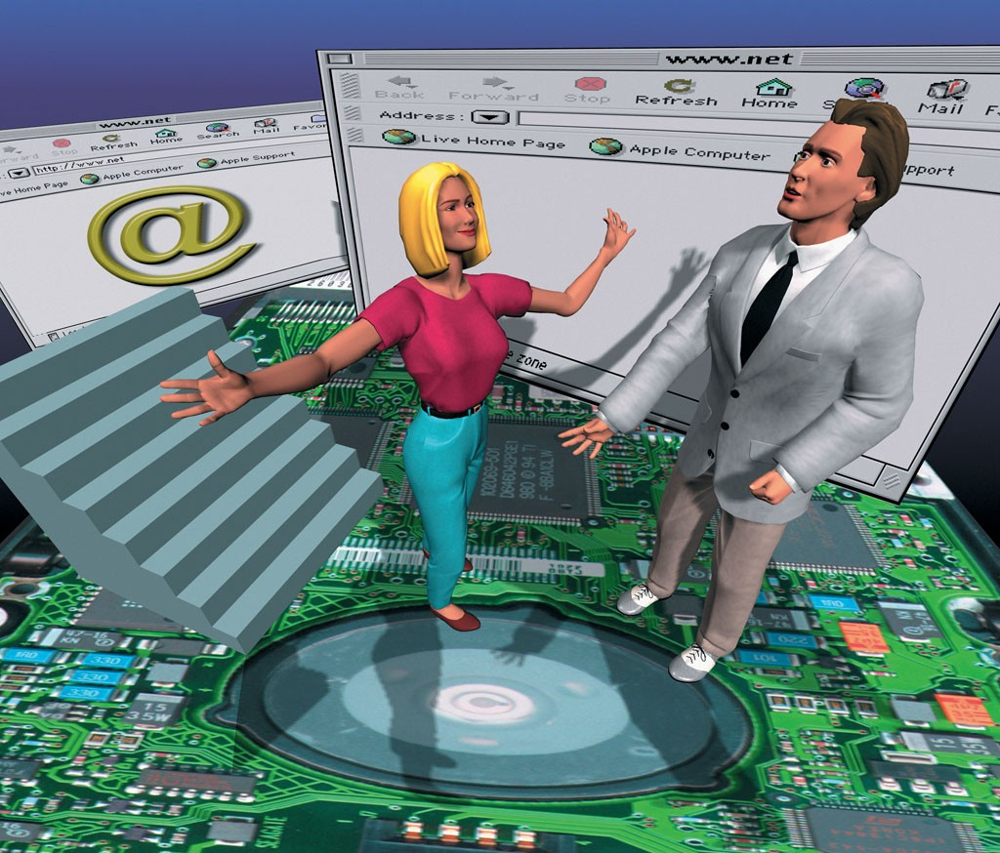
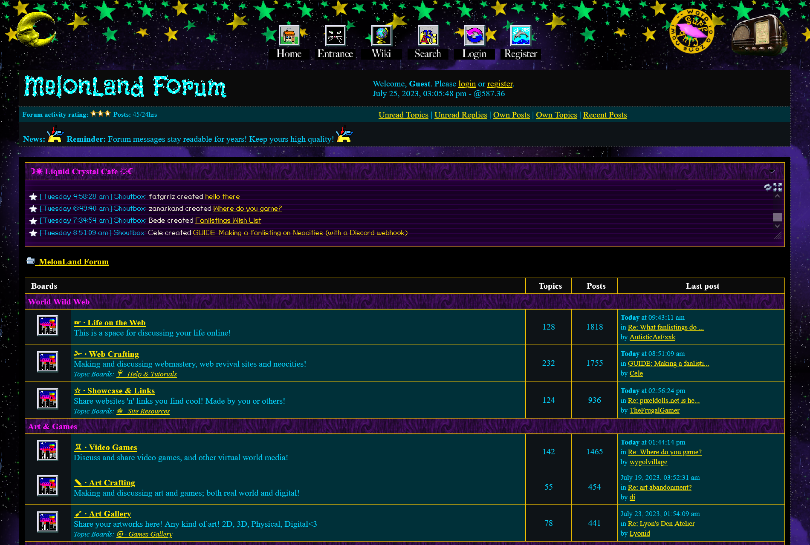
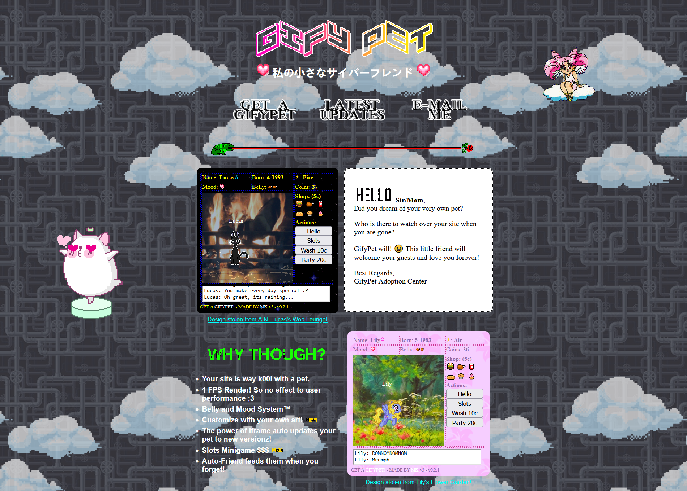
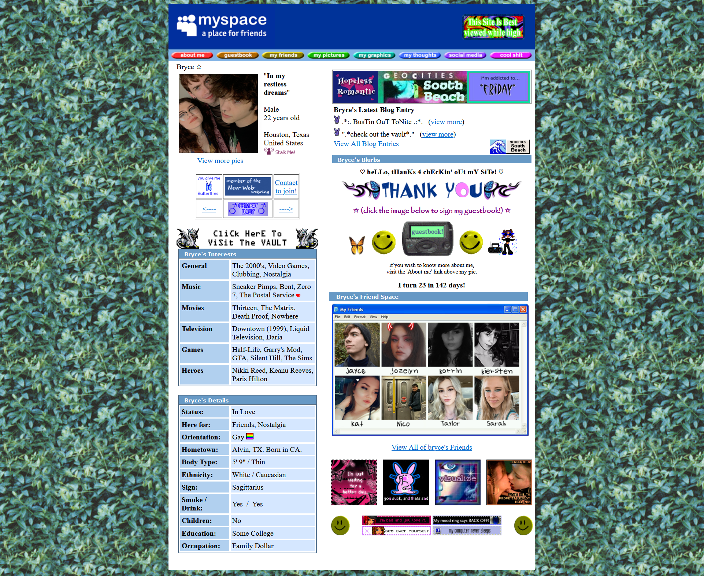

Do you remember the early days of the internet, when websites were a reflection of their creators unique personalities and passions? A time when the digital landscape was a canvas of vibrant colors and creativity, and the online community was the driving force behind its evolution? The internet of yesteryear was a place of genuine connection, diversity, and personal expression. The golden era when the web was a virtual wonderland, ruled by users rather than profit-driven corporations.

"Internet", an unknown 90's stock image

## The Personal Touch

Back then, websites were more like digital diaries. Each website felt like stepping into the creator's mind – a place where they poured their heart and soul, sharing their interests, hobbies, and thoughts with the world. Sadly, im simply too young to remember such a place in detail but i was able to experience some of it during my first steps on the internet back in 2009, when most of these sites were still up and big companies did not yet have the upper hand over the internet.. 

Moreover, the internet provided a platform for enthusiasts to come together and create niche communities. From fan forums to personal blogs, people found like-minded individuals who shared their passions, creating a sense of camaraderie that was truly special. 

The [Melonland](https://forum.melonland.net/) forum

## Colorful Creativity

Each blog was an explosion of colors and creativity. Every website had its own distinctive flair, reflecting the personality of its creator. Whether it was the playful use of neon colors or the subtle elegance of pastel shades, each one stood out from the rest, showcasing the artistry and individuality of its designer.

Web pages were adorned with animated backgrounds, cursor trails, and unique icons. Yes, some might argue that it could get overwhelming at times, but it was just this boundless creativity that made every browsing experience a delightfully unpredictable adventure.

[Gifypet](https://gifypet.neocities.org/), a gif pet creation tool (??!!)

## User-Centric Community

In those days, the internet was driven by its users. Their sites were designed to engage and entertain, not to bombard visitors with advertisements or collect data for profit. Online interactions were genuine, and social media platforms were still in their infancy, free from the burden of algorithms and targeted advertising.

The online community was a powerful force, shaping the internet's evolution through collaborative efforts and shared feedback. User-generated content, such as forums, chat rooms, and guest books, encouraged open discussions and fostered a sense of belonging in the digital realm.

Blog by [Bryce](https://combatbaby.neocities.org/)

## Big corpo

As time passed, the internet underwent a transformation. The rise of social media giants and corporate interests gradually shifted the balance of power from users to profit-driven organizations. The personalized, colorful web pages became streamlined, conforming to modern design standards and sacrificing individuality for uniformity.

Online communities lost some of their authenticity, as algorithms began to dictate content and user engagement. The once user-centric internet was now influenced by commercial interests, and our online experiences were curated based on our data, making it harder to find the hidden gems we once stumbled upon.

I alwas catch myself rotating between the same few websites where all of them happen to be blank and soulless social media sites. Every profile looks the same and i hate it.

## Can we get back?

Today, the internet may have evolved into a more streamlined and efficient entity, but the nostalgia for the old days persists. As we navigate the modern digital landscape, let us not forget the vibrant, user-driven internet of the past, and strive to preserve the spirit of creativity, personalization, and community in our online interactions. After all, the true beauty of the internet lies in the hands of its users – both then and now.

But not all hope is lost and there are some great gems hidden in the depth of the web, which we can enjoy and take an example from. We should let it inspire us to create new blogs and such sites by ourself to (maybe) revive this era of the internet.

I've recently stumbled upon [Wiby](http://wiby.me), which is a search engine that only indexes Web1.0 sites. I've already spent hours surfing through those colorful pages.

There's also a special webhoster called [Neocities](https://neocities.org/) where users can create retro looking pages and host them for free. (Even you could create one as well!)

A [couple of imageboards](https://dollchan.net/chanlist/chanlist-en.html) still exist, who remind us of a different time. You may not like it, but even [4chan](https://4chan.org) is such a place and i am happy that dumpster is still around.

I'm also currently working on a Web1.0 version of my blog. ~~I'll probably update this entry and link to it, once it's finished.~~

[**Here it is!**](https://blog.kicker.dev)