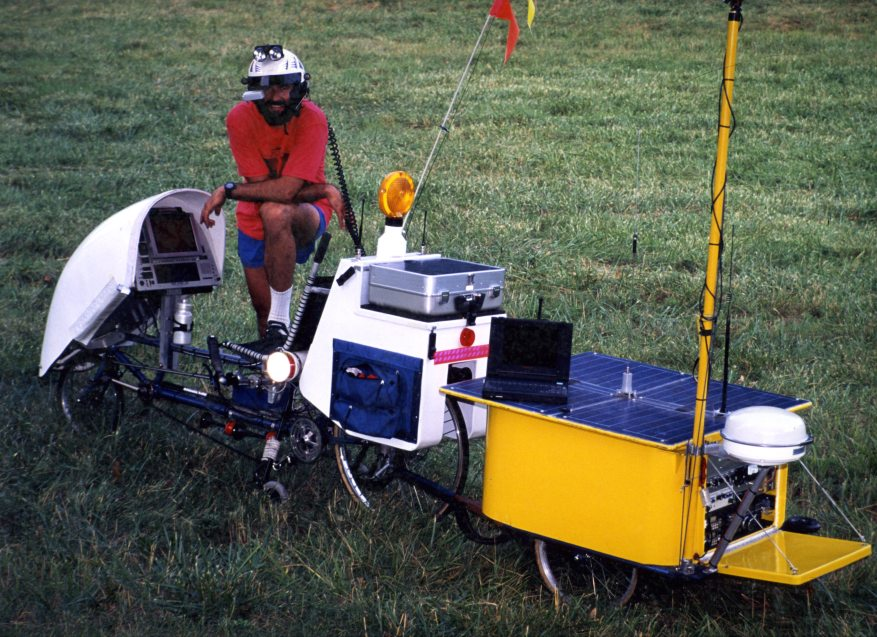
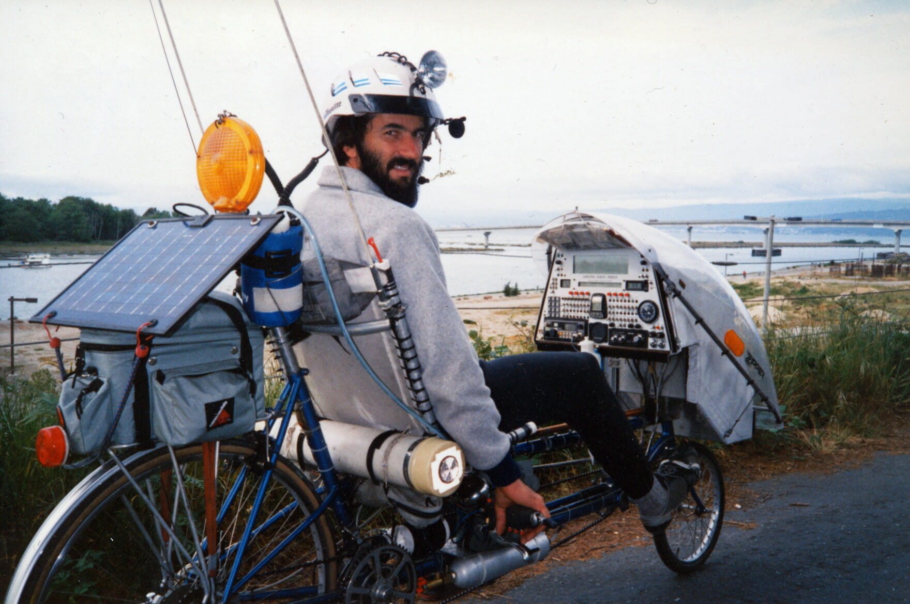
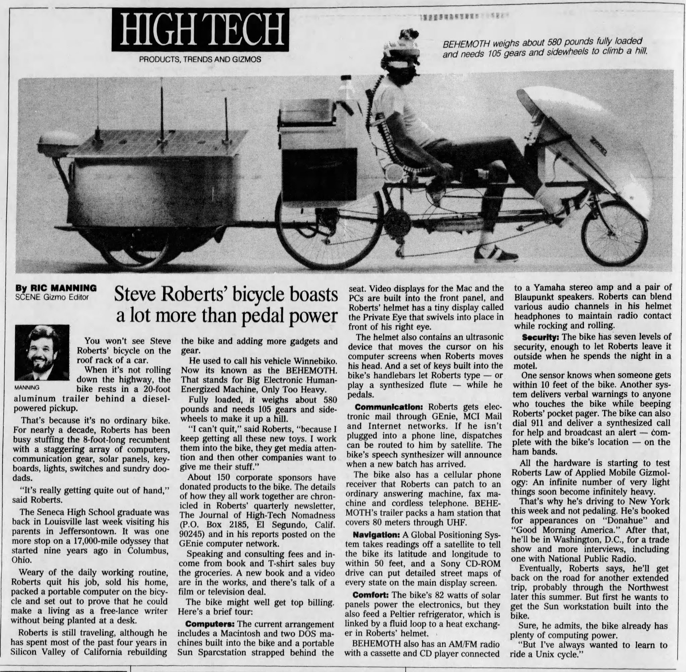
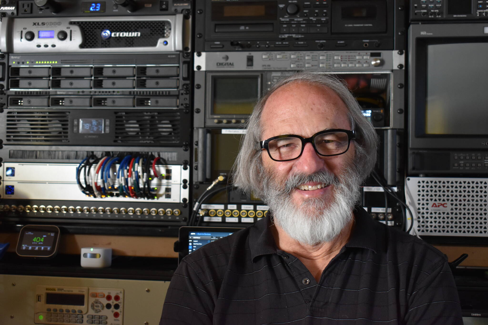
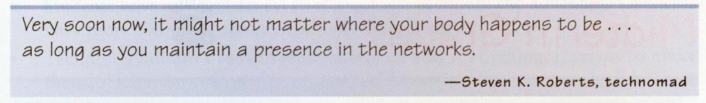

In the 1980s, the idea of working remotely while traveling the world seemed like something straight out of a sci-fi novel. Yet, one man defied the norms of his time and embarked on a groundbreaking journey that would make him the first-ever digital nomad.

Steven K. Roberts and "Behemoth", taken from [Teknomadics](https://teknomadics.com/2011/10/the-original-digital-nomad/)

## A Journey Ahead of Its Time

In 1983, [Steven K Roberts](https://twitter.com/nomadness) set out on an extraordinary adventure, pedaling across the United States on a recumbent bicycle he called "Winnebiko" (his later  models were called "Winnebiko 2" and ["Behemoth"](https://de.wikipedia.org/wiki/Behemoth_(Mythologie))). What made this journey unique was the impressive array of technology packed into the bicycle's streamlined body, including solar panels, a computer, a ham radio, and other cutting-edge gadgets.

Roberts' vision was to merge technology and nomadic living, proving that one could work remotely and stay connected with the world while exploring new horizons. As he traversed the American landscape, he chronicled his experiences and technological innovations in articles for ["Computer Currents" magazine](https://en.wikipedia.org/wiki/Computer_Currents), capturing the imaginations of readers everywhere.

Steven and his second bike, taken from [his website](https://microship.com/bikes/)

## Reactions and Comments

During the 1980s, Roberts' audacious endeavor sparked both awe and skepticism. Many people were fascinated by his nomadic lifestyle and the creative use of technology to maintain communication and work on the go. They saw his journey as an inspirational tale of freedom and possibility, challenging the traditional notion of work confined to brick-and-mortar offices.

However, others viewed Roberts' quest with doubt and disbelief. The idea of working remotely and relying on technology to sustain such a lifestyle was seen as an eccentric and unrealistic notion (lol). Skeptics questioned the feasibility of his technological setup and doubted whether it could lead to any meaningful career.

Nonetheless, the mixture of reactions, whether supportive or doubtful, only fueled Roberts' determination to prove that the concept of remote work and digital nomadism could be more than just a pipe dream.

A newspaper article, photo by [Gizmo](https://gizmoeditor.blogspot.com/2020/09/catching-up-with-digital-nomad-steve.html)

## Life Today

So, what is Steven doing now? Well, after his groundbreaking bicycle journey across the United States, Roberts continued to embrace his technomadic lifestyle to inspire a new generation of digital nomads by sharing his wisdom and expertise through speaking engagements, workshops, and various media platforms. He explored further technological frontiers and authored several books, sharing his experiences and insights into a world that has now fully embraced remote work and digital nomadism.

Not only that, he is still working remotely from his home: A boat c:

Roberts in his home, taken from [The Journal of San Juan Islands](https://www.sanjuanjournal.com/life/wizard-with-a-time-machine/)

## He paved the way

Steven K Roberts' bold journey as the first digital nomad was truly something new. His fusion of technology and nomadic living challenged societal norms and laid the groundwork for the modern-day remote work revolution. Although met with both curiosity and skepticism, Roberts' determination and vision proved that the impossible can become possible with courage and creativity.

The internet revolution that followed in the 1990s and early 2000s further expanded the possibilities for remote work and nomadic living. Today, countless individuals around the globe are living the dream that Roberts dared to dream decades ago.

Quote from Steven, far ahead of his time

