I've been running my own server for about 2.5 years now and have gained a lot of experience in the process. Since a friend of mine asked about my setup and some tips, I thought it would be best to publish another blog post on this topic. This is one of my more tech-savvy posts, so feel free to skip it if you're not interested (as if I have any say in this...). I'll keep this entry updated as long as I'm willing to.

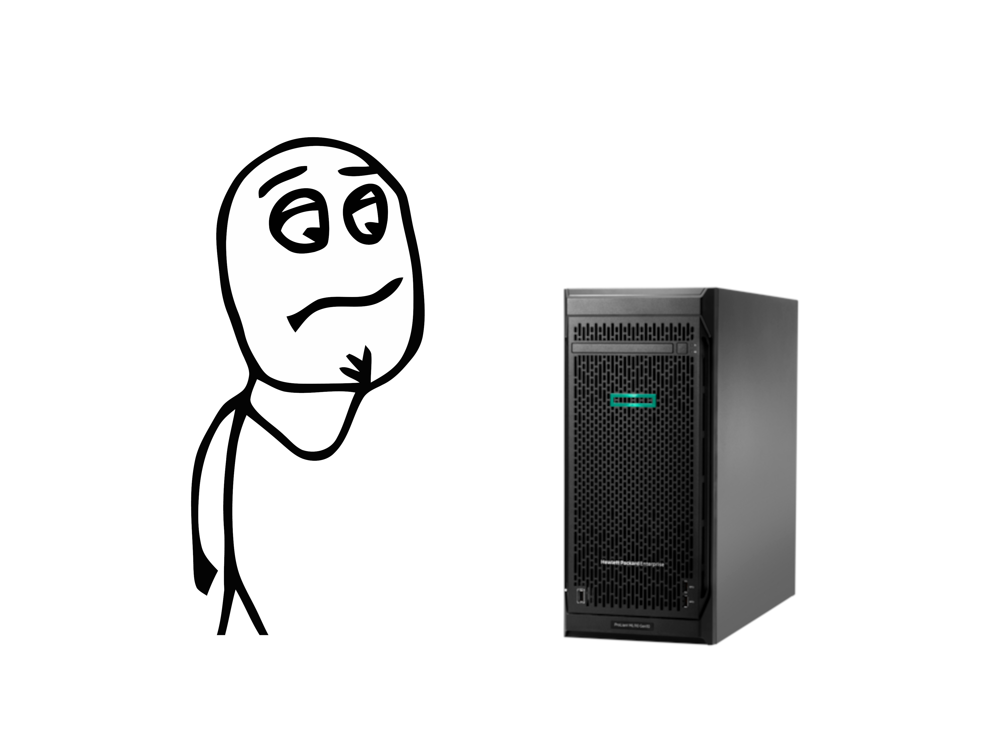

Me, sometime at the beginning of 2022

## Reasoning

Why would you actually want to host everything yourself in the first place? I mean, it's a lot of work, a ton of stress, and requires constant maintenance?

- **Availability**: Every single day approximately [3,992,222 websites are created](https://themeisle.com/blog/how-many-websites-are-there/) (which is a lot, WTF). However, many sites also become unavailable, leading to data loss, like the shutdown of [LiveLeak](https://www.theverge.com/2021/5/7/22424356/liveleak-shock-site-shuts-down-itemfix), the deletion of YouTube channels, or [countless minutes of pornographic material](https://www.buzzfeednews.com/article/otilliasteadman/pornhub-removes-videos). There are even entire communities dedicated to gathering so-called [lost media](https://www.reddit.com/r/lostmedia/top/?t=all). 

- **Ownership**
Another problem we encounter is that we do not own anything anymore. Seriously, every type of media most people consume comes from streaming services like YouTube, Netflix, Disney+, or Spotify. Every file we consume is rented and not owned by ourselves. Self-hosting, on the other hand, ensures your data never gets lost and is completely owned by you and only you.
- **Privacy**: Your data remains on your premises, reducing the risk of data breaches and unauthorized access that might occur on third-party servers. Of course some of your applications will share information with third parties but at least you'll be more in control on who has your data
- **Complete Control**: You have full control over the software, configurations, and data. You can customize everything to meet your specific requirements.
- **Gaining Technical Skills**: Managing your own server helps you develop valuable skills in system administration, networking, security, and troubleshooting. And trust me, there'll be a lot of troubleshooting...
- **Open Source Support**: By self-hosting, you can support and utilize open-source software, contributing to and benefiting from community-driven projects.
- **Data Sovereignty**: Ensures that your data resides within your jurisdiction, avoiding legal complications associated with cross-border data transfer.
- **Reliability**: You can design your infrastructure for high availability and redundancy, ensuring continuous service without relying on third-party uptime. Like still being able to access your media in case of a network outage.
- **Customization**: You can tailor the software and services to your exact needs, adding features or making changes that hosted solutions might not allow.
- **Cost Savings**: Over time, self-hosting can be more cost-effective than paying for recurring subscription fees for hosted services. Keep in mind that the initial costs will be enormous though!
- You may also use your server-project on your resume or use it for content if you run out of material for your blogs :)

## What to keep in mind

Let me tell you this before you even start to think about starting your own server: It'll cost you a ~~fuck ton~~ lot of nerves and time. Don't go into this project thinking it will be easy and you will be done in no time. It requires a lot of troubleshooting, a lot of research, and a huge pile of failures. You'll need discipline to stay on track.

You'll gain a considerable amount of technical knowledge, but you'll also need some basic networking skills. Take some time to study those basic abilities before you start this project. Stop browsing Reddit for the best dashboard theme if you cannot tell me how DHCP works.

Depending on your situation, there may be a lot of initial costs for the hardware you'll use. I was lucky enough to use my "old" gaming PC since I grew out of my gaming phase a long time ago. I know it isn't energy-efficient at all, but it works for now (you'll encounter this situation a lot during this or similar software projects).

## My setup

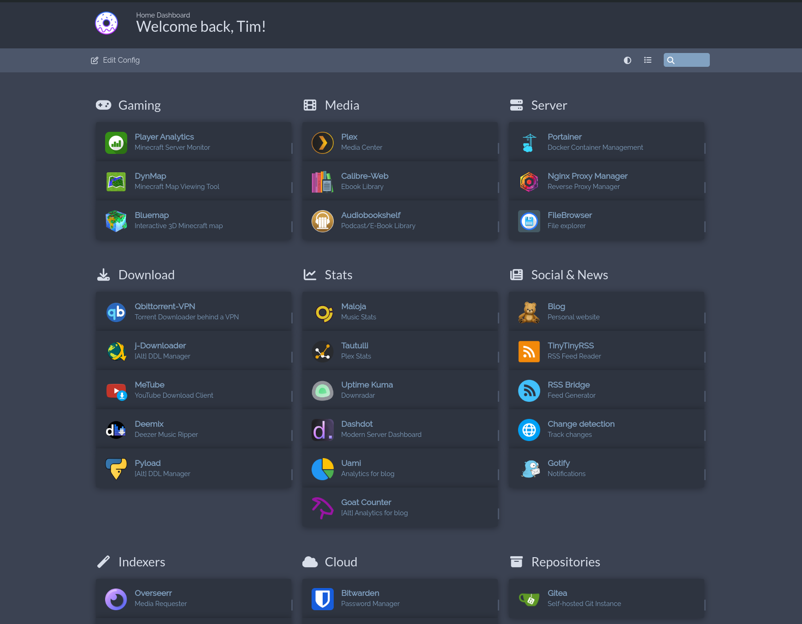

I am currently using Ubuntu LTS, as it's a pretty reliable operating system for servers. There are countless alternatives like Debian or RockyLinux. However, if I had to restart this project from scratch, I'd probably go with [OpenMediaVault](https://www.openmediavault.org/) this time.

I chose to run all my applications using [Docker](https://www.docker.com/why-docker/) because I think it's the best way to run server applications. Docker allows us to package applications into containers, each containing the application code, runtime, libraries, and dependencies needed to run the application consistently across different environments.

Since most self-proclaimed administrators choose to set up a dashboard to maintain a clear perspective on my applications, I opted not to include things like a search engine or third-party websites such as some social media sites, since I only use [this dashboard](https://github.com/bastienwirtz/homer) for navigation and nothing else.

## Media

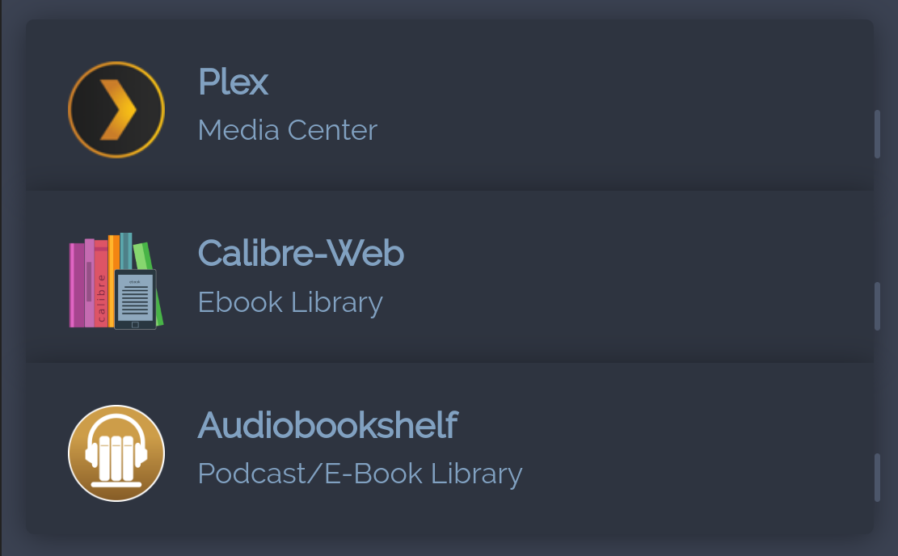

### [Plex](https://watch.plex.tv/en-GB) 
The Plex home server application is a media server software that allows users to organize, manage, and stream their personal media collections, including movies, TV shows, music, and photos, to various devices. Plex Media Server is installed on a computer or NAS (Network Attached Storage) device, where it scans and catalogs the user's media, adding metadata and artwork for a polished library presentation. Users can then access their media from anywhere using the Plex app on smartphones, tablets, smart TVs, streaming devices, and web browsers. Plex also offers additional features such as live TV and DVR capabilities, support for various plugins, and premium options like Plex Pass for enhanced functionality and content access wich was bought by me. Alternatives like Emby & Jellyfin (Open Source) exsit, but have not been thested by me.
### [Calibre Web](https://github.com/janeczku/calibre-web)
 A web-based application that provides a user-friendly interface for managing and accessing eBook collections stored in a Calibre database. It allows users to browse, read, and download eBooks via any web browser, offering features like metadata management, advanced search, and multi-user support with customizable permissions. The application includes an integrated eBook reader for convenient online reading.
### [Audiobookshelf](https://www.audiobookshelf.org/) 
Also a web-app designed for managing and streaming audiobook collections. It allows users to organize their audiobooks, providing features like detailed metadata management, cover art, and chapter information. Users can stream their audiobooks from any device with a web browser, offering a seamless listening experience with features such as bookmarking, playback speed adjustment, and multi-user support for personalized access and library management.
## Server

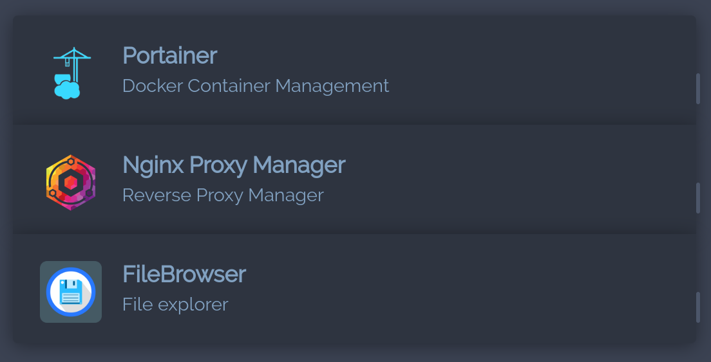

Those applications are (in my opinion) essential for managing a server as they make life so so much easier.

### [Portainer](https://www.portainer.io/)
 A lightweight, web-based management UI for Docker, Docker Swarm, and Kubernetes that simplifies container and cluster management. It provides an intuitive interface for deploying, monitoring, and managing containers, images, networks, and volumes, making it accessible for both novice and experienced users. Portainer supports multi-cluster environments and offers features like role-based access control, real-time monitoring, and integration with various cloud services.
### [Nginx Proxy Manager](https://nginxproxymanager.com/) 
A user-friendly, interface for managing Nginx proxy servers. It simplifies the process of setting up and configuring reverse proxies, SSL certificates, and forwarding rules. Key features include an intuitive dashboard, automated SSL certificate management via Let's Encrypt, and support for custom Nginx configuration snippets. Nginx Proxy Manager is ideal for users who need an easy way to manage and secure their web applications and services.
### [FileBrowser](https://filebrowser.org/) 
A file management application that provides an intuitive interface for browsing, managing, and sharing files on a server. It allows users to upload, download, edit, and organize files and directories from any device with a web browser. Key features include user authentication, customizable access permissions, support for various file operations, and a clean, responsive design for ease of use. FileBrowser is ideal for creating a simple and efficient file management system accessible over the web. Keep in mind that you wont be able to share files over 500MB if you run it through a Cloudflare proxy. I mainly use this inside my network or for sharing media for direct-viewing or small documents
## Download

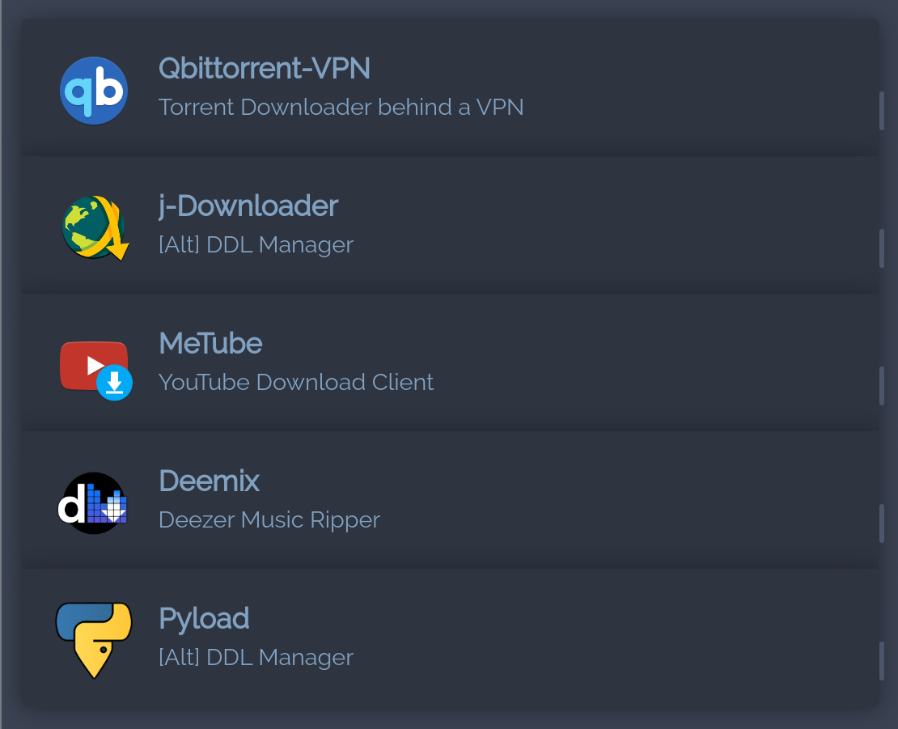

Making downloads on a home server offers several advantages over downloading directly on personal computers. Firstly, it offloads resource-intensive tasks like downloading large files or torrents, which can slow down or tie up local machines. It also centralizes management, allowing for continuous downloads even when individual computers are turned off. Additionally, a home server can automate downloads, manage storage more efficiently, and provide a centralized location for accessing downloaded files from any device on the network, enhancing convenience and accessibility.

### [QBittorrend Web + VPN Killswitch](https://github.com/MarkusMcNugen/docker-qBittorrentvpn) 
A web-ui for managing the qBittorrent client, a popular open-source BitTorrent client. It allows users to remotely control their torrent downloads and uploads from any device with a web browser. Key features include adding and managing torrent files, setting download priorities, monitoring download/upload speeds, and configuring various client settings. This docker images includes a killswitch that disables all network traffix if the installed VPN fails. The interface is designed to be user-friendly and provides a comprehensive solution for managing torrents efficiently from a remote location. Please dont even think to use uTorrent or Bittorrent as they are bloated adware. Transmission is a great alternative.
### [J Downloader 2](https://github.com/jlesage/docker-jdownloader-2)
An open-source download management tool designed to simplify and automate the downloading of files from various online platforms. It supports downloading from a wide range of file hosting services, streaming sites, and content platforms. Key features include parallel downloading, link encryption, automatic CAPTCHA solving, and support for paused and resumed downloads. JDownloader is available on multiple operating systems and provides a user-friendly interface to manage and accelerate download tasks efficiently.
### [MeTube](https://github.com/alexta69/metube) 
It's a UI for youtube-dl, a popular command-line tool used for downloading videos from various websites including YouTube. This web UI simplifies the process of downloading videos by providing a graphical interface accessible through a web browser. Users can paste video URLs into MeTube, which then utilizes youtube-dl in the background to fetch and download the requested content. MeTube typically offers features such as selecting video quality, managing downloads, and displaying download progress, making it more accessible for users who prefer not to use the command line directly.
### [Deemix](https://gitlab.com/Bockiii/deemix-docker) 
Deemix is a specialized music streaming application that focuses on downloading high-quality music tracks directly from Deezer, a popular music streaming service. It allows paying users to bypass the limitations of Deezer's standard streaming by providing access to lossless FLAC audio files and high-quality MP3 downloads. Deemix also supports features like downloading entire albums or playlists, automatic tagging of downloaded tracks with metadata, and managing music libraries. It's widely used among music enthusiasts who value high-quality audio and want offline access to their favorite songs without relying on traditional streaming platforms. The application has shut down further development, however it's still working at the time of writing.
### [Pyload](https://pyload.net/) 
Also an open-source download manager that provides a web-based interface for managing and automating downloads from various file hosting websites, streaming services, and other online sources. It allows users to queue up and download files using protocols like HTTP, FTP, and BitTorrent. Key features of Pyload include captcha recognition, support for premium accounts on file hosting sites, plugin architecture for extending functionality, and scheduling downloads. Pyload is designed to be lightweight, efficient, and accessible via any web browser, making it convenient for users to manage their download tasks remotely. It can also be used in combination with the J-DL extension

## Stats

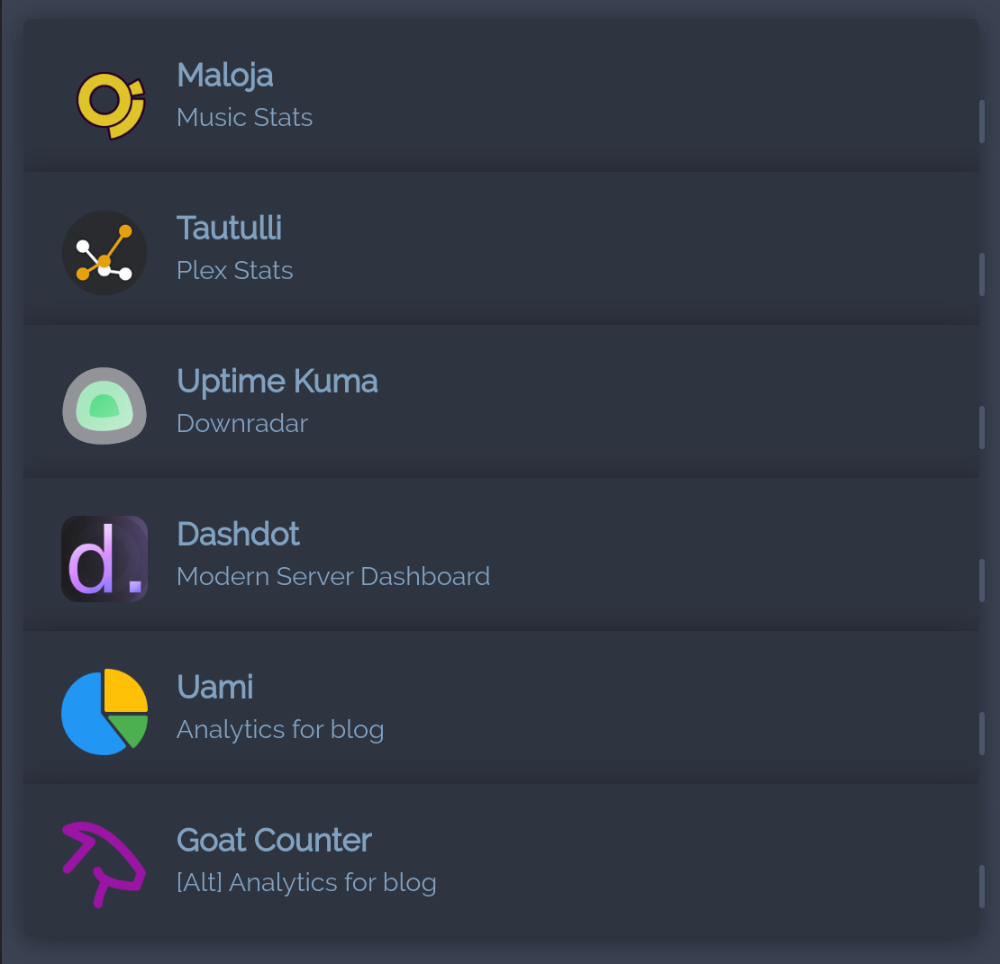

### [Maloja](https://github.com/krateng/maloja) 
Maloja is a self-hosted alternative to Last.fm, designed to provide similar music tracking and scrobbling functionalities. Users can set up Maloja on their own server to track their listening habits over time. It allows for integration with various music players and supports scrobbling data from these players to build a personal music profile. Maloja emphasizes privacy and control over user data, making it an attractive option for those who prefer self-hosted solutions over relying on third-party services like Last.fm. Here's a [link to my instance](https://music.kicker.dev)
### [Tautulli](https://tautulli.com/) 
An application designed for monitoring and analyzing Plex Media Server usage. It provides real-time insights into playback history, user activity, and media statistics through customizable dashboards and detailed analytics. Tautulli also offers notifications and user management features, making it an essential tool for Plex administrators to track server performance and user interactions effectively.
### [Uptime Kuma](https://github.com/louislam/uptime-kuma) 
A monitoring tool that helps track the uptime and performance of websites, services, and servers. It offers a clean, responsive web interface where users can add monitors to check the availability and response times of their applications from different geographical locations. Uptime Kuma supports notifications via various channels (like email, Slack, Telegram) for downtime alerts, and it provides historical data and uptime reports to help analyze trends and identify potential issues proactively. It's designed to be lightweight, easy to deploy, and suitable for both personal and small business use cases. Here's an example [for all my public services](https://status.kicker.dev/status/public). I am currently running this on the same machine where all my other stuff is hosted, except my own vpn and my blog. However i do advise against this since a uptime monitor is of no use if it goes offline as well if my server fails.

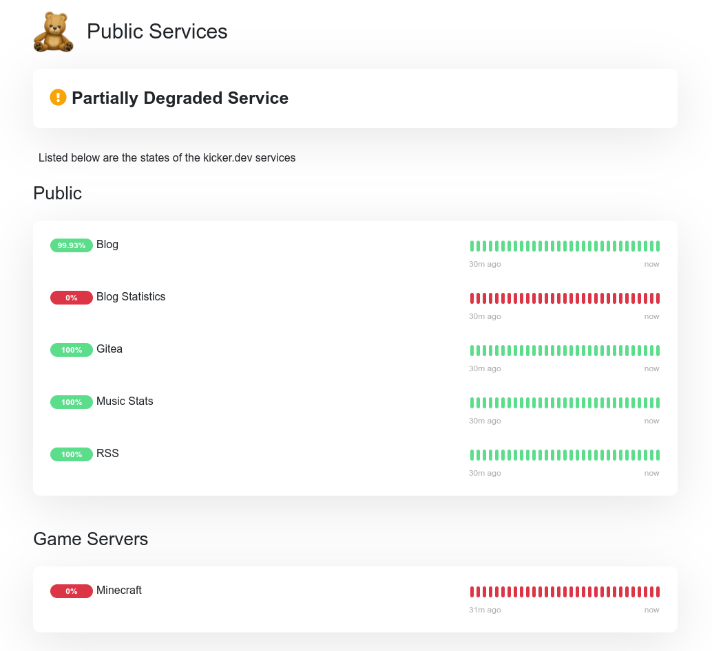

Kuma-UI of for my public services

### [Dashdot](https://getdashdot.com/)
 Dashdot, also known as "ash.", is a modern server dashboard designed with a focus on aesthetics and functionality. It incorporates glassmorphism design principles, which emphasize a sleek, transparent, and layered visual style. Dashdot is tailored for smaller VPS (Virtual Private Servers) and private servers, offering a user-friendly interface (which looks amazing if you'd ask me)to monitor server metrics, manage services, and view system information. It aims to provide an intuitive and visually appealing dashboard experience for users managing their own servers, combining modern design with practical server management tools. It also offers the ability to switch between dark and light-mode.

Screenshot of the dashdot dark-ui

### [Umami](https://umami.is/) 
A comprehensive website analytics platform designed to provide real-time data insights for making informed decisions, which is used to track [statistics for my blog](https://stats.kicker.dev/share/1Ui8dKfjsfQGAVs5/tim.kicker.dev). It offers a range of analytic features including visitor information such as device, browser, OS, and location details, page views, bounce rates, traffic sources, and visitor demographics like language and device usage. The platform supports comparing metric performance across different date ranges, applying filters for deeper analysis, and tracking custom events and data properties. It emphasizes privacy with GDPR and CCPA compliance, ensuring no collection of personal information, anonymizing visitor data, and avoiding the use of cookies. Users have full control over their data, whether self-hosted or using Umami Cloud, which offers managed services including upgrades, database tuning, backups, and high-performance data handling for large datasets. Additionally, Umami features data import and export capabilities, email reporting, and tools like funnels, retention analysis, and goal tracking to enhance website optimization efforts. It also offers a dark-ui

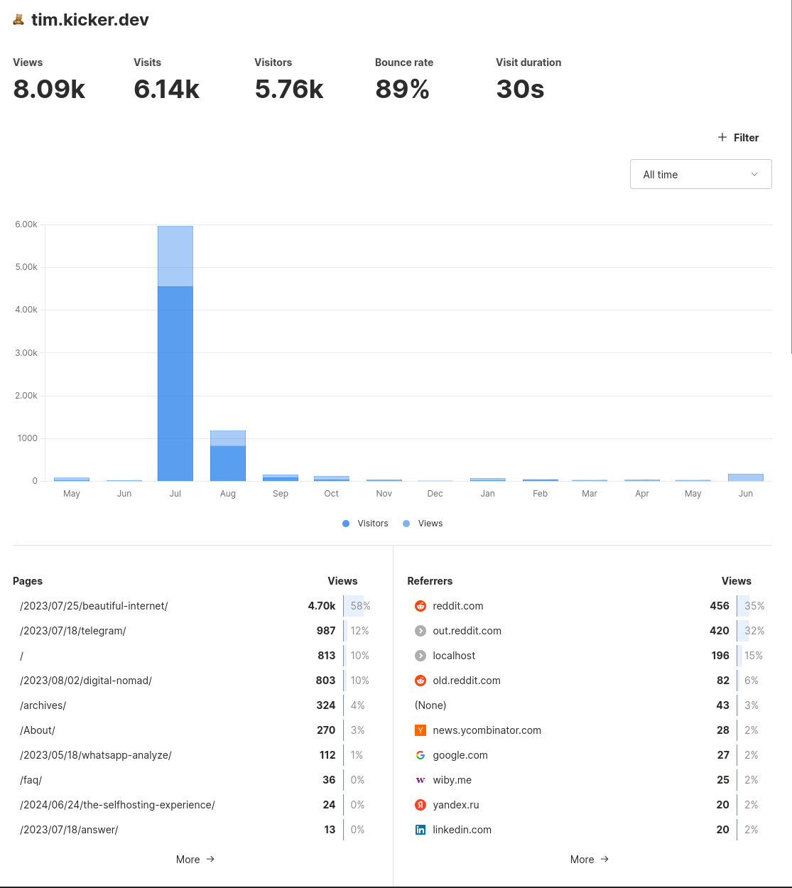
Page 1 of my umami-stats at the time of writing this post

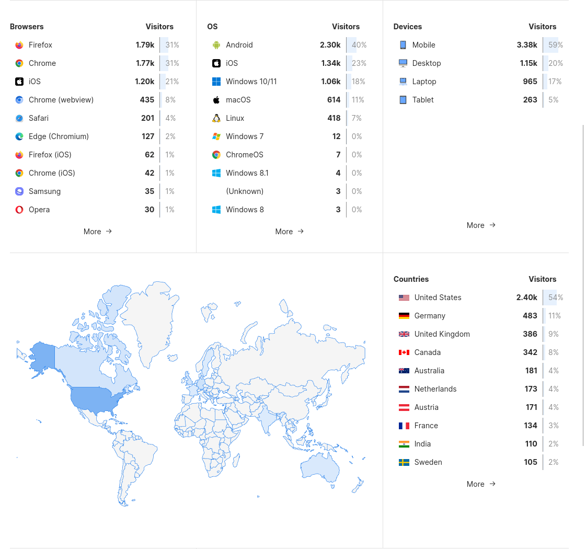

Page 2, which even features a world-map

### [Goat Counter](https://www.goatcounter.com/)
It's just a minimal (open source) alternative to umami, which i chose to [host as well](https://altstats.kicker.dev/?hl-period=year&period-start=2023-06-26&period-end=2024-06-26&filter=&as-text=off&daily=off) in order to make sure the data maches.
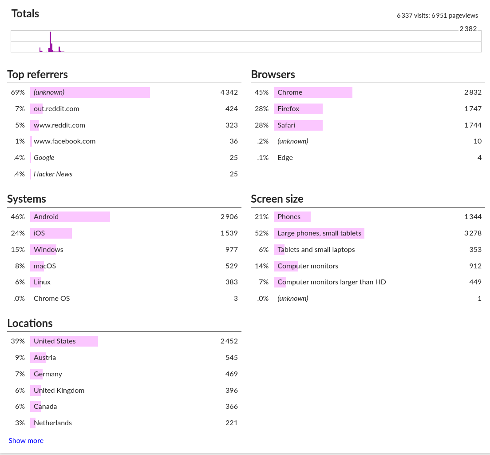

Goatcounter-UI with (somewhat) matching stats

## Social & News

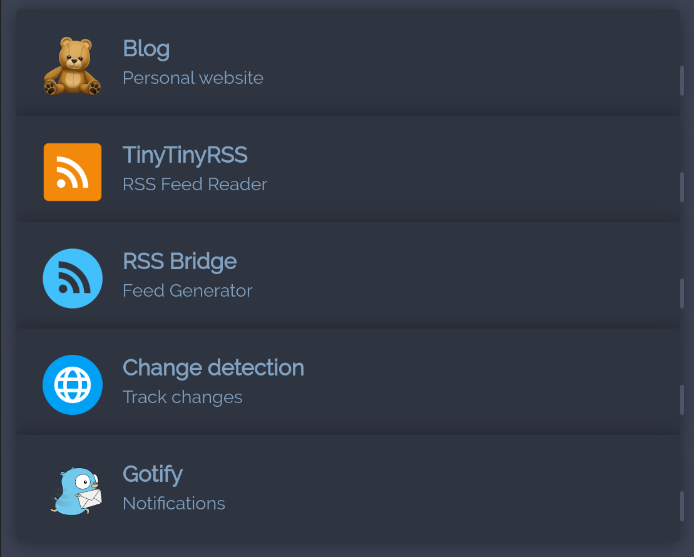

### [TinyTinyRSS](https://github.com/clue/docker-ttrss)
TT-RSS is a self-hosted, open-source web application for managing and reading RSS and Atom feeds. I grew tired of checking 100 different social media sites every day and found TT-RSS to be the perfect solution, despite requiring some time setting up. It allows users to subscribe to multiple feeds, organize them into categories, and read articles within a customizable interface. TT-RSS supports features like article filtering, search functionality, synchronization across devices, and customization through themes and plugins, making it a flexible choice for individuals or small teams looking to manage and consume news and content efficiently. There are also many desktop clients available for pretty much all operating systems, enhancing accessibility and usability across different devices and platforms.
### [RSS Bridge](https://rss-bridge.org/)
RSS-Bridge is a PHP-based open-source project that acts as a bridge between various websites and RSS feeds. Almost no site left has an enabled RSS feed, even if they had it once, and I am using RSS-Bridge because all social media sites are locking down access (Also called [Enshittification](https://en.wikipedia.org/wiki/Enshittification) of the internet). It fetches content from websites that do not provide their own RSS feeds and generates RSS feeds for users. This allows users to subscribe to updates from these websites using their preferred RSS feed reader. RSS-Bridge supports a wide range of sources including social media profiles, online forums, and other websites, providing a convenient way to aggregate content from different platforms into a single RSS feed for easier monitoring and consumption.
### [Change detection](https://github.com/dgtlmoon/changedetection.io)
Self-hosted change detection (alternative to changedetection.i) enable users to monitor specified web pages for updates and changes over time. These tools provide alerts and notifications when modifications occur, allowing users to stay informed about content revisions or updates on websites they track. They offer customization options for monitoring intervals and notification preferences, ensuring privacy and control over monitored data, which is beneficial for individuals and organizations needing timely updates on specific web content.
### [Gotify](https://gotify.net/)
Used for sending and receiving messages in real-time via a RESTful API. It allows users to set up their own notification server, which can then be used to push messages to various devices and applications. Gotify supports features such as user authentication, message prioritization, and integration with third-party services through plugins. It's designed to be lightweight, easy to deploy, and suitable for personal or organizational use cases where real-time notifications are needed without relying on external services.

*Great thing I'm writing this blog, as i clompletely forgot to set this up on my (not so new) phone, 8 months ago*

## Indexers

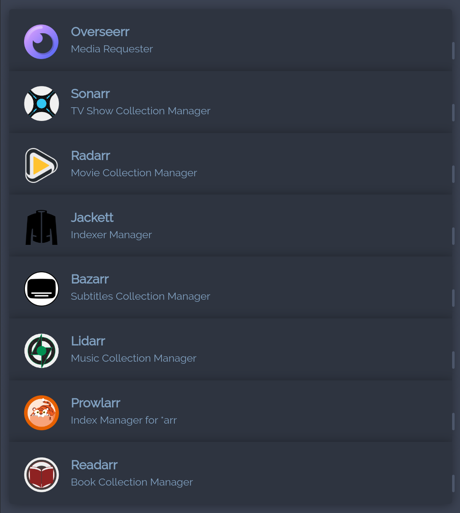



This section is entirely fictional. The following services mentioned are not, and will never be, used by me, as they operate in violation of copyright laws. I do not condone such actions and strongly discourage anyone from attempting them. This fictional segment is intended solely for stylistic purposes.



### [Servarr](https://wiki.servarr.com/)

These applications are commonly used alongside a download client (e.g., qBittorrent, SABnzbd) and a media server (e.g., Plex, Emby) to create a complete media management and streaming solution. They are popular among users who want to automate the acquisition and organization of media content from various online sources.

1. **Sonarr**:  
   - Manages and automates TV show downloads.
   - Subscribes to TV series, searches for new episodes, and downloads them automatically.

2. **Radarr**:  
   - Manages and automates movie downloads.
   - Adds movies to a watchlist, searches for available releases, and downloads them via torrent or Usenet.

3. **Lidarr**:  
   - Manages and automates music downloads.
   - Adds artists and albums to a watchlist, searches for new releases, and downloads music files.

4. **Readarr**:  
   - Manages and automates e-book downloads.
   - Tracks and downloads new releases from authors or series.

5. **Prowlarr**:
    - Manages and automates TV show downloads from Usenet indexers.
    - Integrates with Usenet indexer services for automatic searches and manages download clients like SABnzbd or NZBGet.

### Unofficial Servarr-Applications

1. [**Overseerr**](https://overseerr.dev/):  
   - Simplifies the management and requesting of media content from various sources (Perfect for friends and family). It integrates with services like Plex, Sonarr, Radarr, and others to automate the process of requesting movies and TV shows. Users can submit requests for content they want to watch, and Overseerr handles the monitoring and retrieval of those requests once available. It provides a unified interface for managing media requests, tracking their status, and notifying users when content becomes accessible. Overseerr enhances the media consumption experience by centralizing and automating the request and retrieval process.

2. [**Jackett**](https://github.com/Jackett/Jackett):  
   - Manages and automates subtitles for movies and TV shows.
   - Integrates with various subtitle providers to download subtitles in multiple languages.
   - Monitors media libraries for new content and automatically fetches subtitles.

3. [**Bazarr**](https://www.bazarr.media/):  
   - Manages and automates subtitle downloads for movies and TV shows.
   - Integrates with various subtitle providers to download subtitles in multiple languages.
   - Monitors media libraries for new content and automatically fetches subtitles to enhance viewing experience.
   - Still have not found a way to make it work hmpf

## Cloud & Repositories

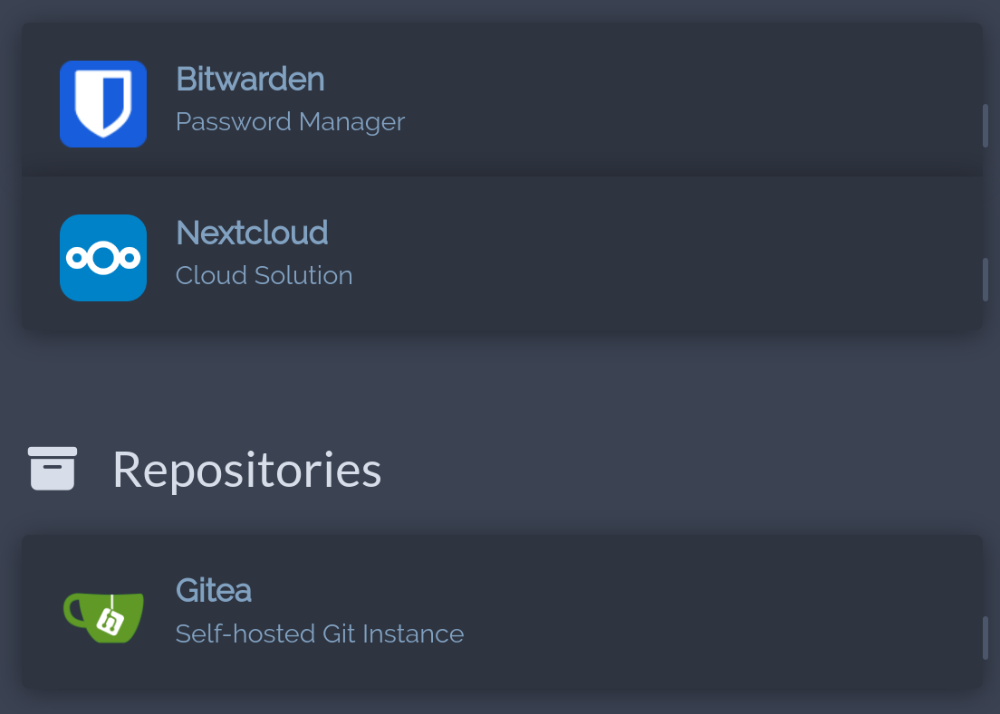

### [Bitwarden (Vaultwarden)](https://www.vaultwarden.ca/home/)
An open-source password manager server compatible with Bitwarden clients. It allows users to self-host their own password management solution, providing secure storage and encryption of sensitive information such as passwords, secure notes, and credit card details. Vaultwarden supports features like two-factor authentication (2FA), organization of items into folders, sharing of items with other users, and audit logging. It aims to provide a robust and customizable alternative to cloud-based password managers, ensuring users retain control over their data and security practices.
I'm using this container only for backup purposes at the moment.
### [Gitea](https://about.gitea.com/)
Gitea is a self-hosted Git service (like Gitlab but better lol) that provides a user-friendly interface for hosting and managing Git repositories, issue tracking, and collaboration. It offers features like pull requests, code review, user management, and integration with webhooks and APIs for automation. Gitea is designed to be lightweight, fast, and suitable for individuals and small teams looking to host their Git projects securely on their own infrastructure. Here's a [link to my instance](https://git.kicker.dev/timkicker/tim.kicker.dev) where the source-code of my blog is hosted as well.

## Gaming

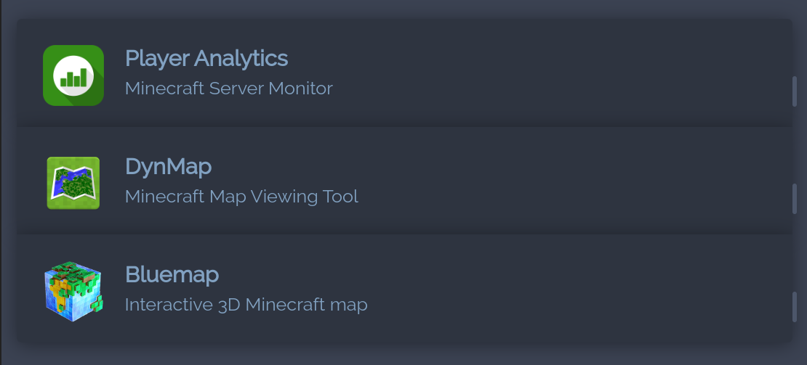

Currently, all my gaming-related containers are just plugins used for my Minecraft server. However, none of them are active at the moment as my Minecraft server has been shut down by me. Nevertheless, I still wanted to list them.

### [Player Analytics](https://www.spigotmc.org/resources/plan-player-analytics.32536/) 
Player analytics for Minecraft involves tracking and analyzing player interactions and behaviors within Minecraft servers. It provides insights into player activity such as logins, playtime, in-game actions like building and exploration patterns, economy transactions, and community interactions. These analytics help server administrators optimize server performance, tailor content updates, and foster a vibrant community environment by understanding player preferences and behavior trends.
### [Bluemap](https://bluemap.bluecolored.de/) 
A web-based mapping tool designed for Minecraft servers that generates interactive, real-time maps of Minecraft worlds in 3D (!!!). It allows players and server administrators to view detailed, dynamic maps of their Minecraft environments directly in a web browser. Bluemap updates maps in real-time as players explore and modify the world, showcasing features like terrain, structures, and player-built creations. This tool enhances gameplay by providing a visual representation of Minecraft worlds, aiding navigation, planning, and community engagement within the game.
### [Dynmap](https://www.spigotmc.org/resources/dynmap%C2%AE.274/) 
Like Bluemap but in 2D

## Some tipps

- **NEVER CHANGE A WORKING SYSTEM**: Please, for the love of God, only update your server when you are willing to take a few hours to fix your entire setup if something fails. Because it will. Also, take some time to check if you *really, really* need this new fancy application, which is pretty much a duplicate of an existing one and you'll use it once for testing and never again afterwards. "bUt jUsT iN cAsE iLl kEeP it", no you wont. Trust me, I've been guilty of this behaviour several times.
- Spend some time planning. Create a to-do list, plan when and how you want to work on it, and create a file tree. Here's mine, for example:
- Only use the root account if you have to. Create a separate one for all sorts of things, which will increase your security a ton.
- Spend a lot of time on security. I know you just got your system to work after some hard days, and you are not motivated anymore in the slightest to upgrade your security, but please do it. I know you'll probably not get hacked or something like that, but the chance still exists. Take a look into topics like Firewalls, Cloudflare, VPN, etc.
- Do not get into shady topics like piracy. You know it's illegal! I know nothing will happen if I use a VPN with a killswitch, but still!! >:=(  I'll link you some sources regarding this topic so you can avoid these corners:
  - [Piracy Wiki](https://piracy.now.sh/): Very evil
  - [Windscribe](https://windscribe.com/yo/4123svm9): A great priced VPN. You may not avoid this (i know wrong location in this post) but it still can be used to mask your identity regarding piracy. I am not partnered with this company in any way as, this is just my affiliate link which'll grant you some extra bandwith.
  - [Torrentleech](Torrentleech.org): A widely used private-tracker: Extremely evil :(
  - [1337x](1337x.to): A free tracker: Also really evil because it's publicly accessible

Obligatory (somewhat) fitting [xkxd comic](./the-selfhosting-experience/workflow.png) regarding the working system

## Resources

I completely relied on sources from the web when it came to gaining knowledge (and still do). So I'll link you some great resources, which helped me enormously.

- [**Awesome Selfhosted**](https://github.com/awesome-selfhosted/awesome-selfhosted): A list of Free Software network services and web applications which can be hosted on your own servers.
- [**/r/selfhosted**](https://www.reddit.com/r/selfhosted/): A place to share, discuss, discover, assist with, gain assistance for, and critique self-hosted alternatives to our favorite web apps, web services, and online tools.
- [**/r/homelab**](https://www.reddit.com/r/homelab/): A community for discussing home labs, including self-hosting setups and hardware recommendations. Read through the wiki!
- [**DB Tech**](https://www.youtube.com/@DBTechYT): Probably the best channel you'll find regarding self-hosting. He's specialized in stuff like Docker, Portainer, and other self-hostable applications, and he's an amazing teacher, wow!
- [**Linuxserver.io**](https://docs.linuxserver.io/images/): An amazing and huge list of Docker images consisting of all kinds of applications.
- **Me**: Since I am pretty experienced when it comes to this kind of stuff, you are more than welcome to contact me if you need any help :)

